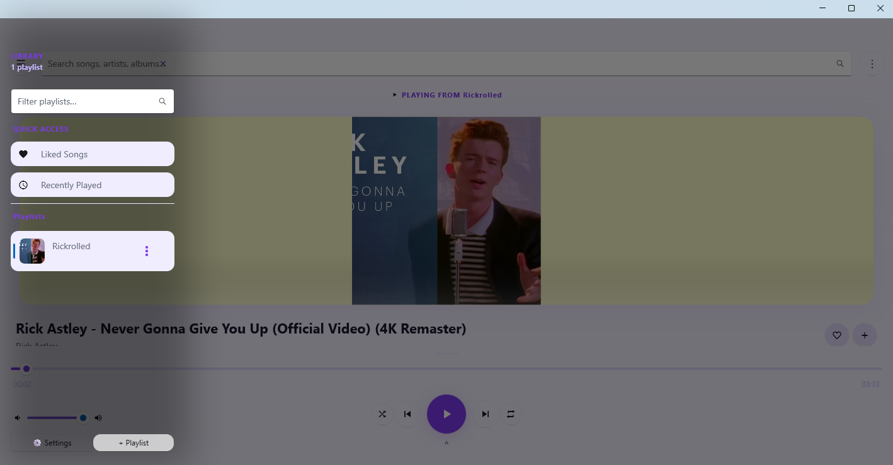
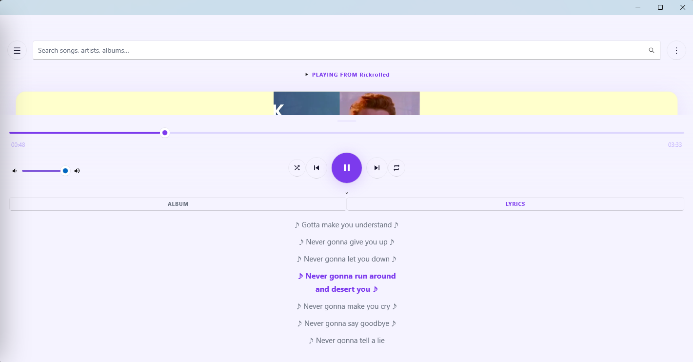
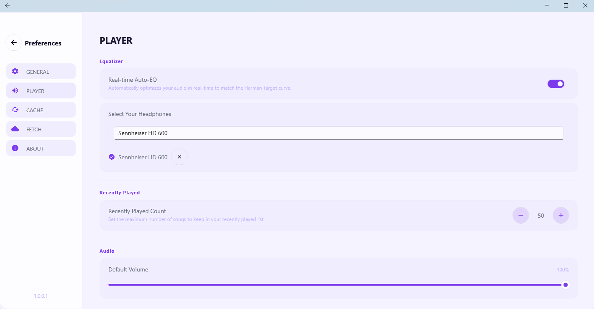
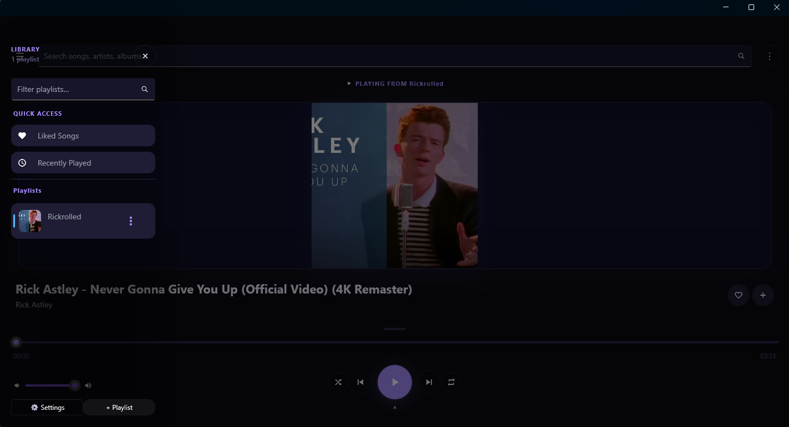
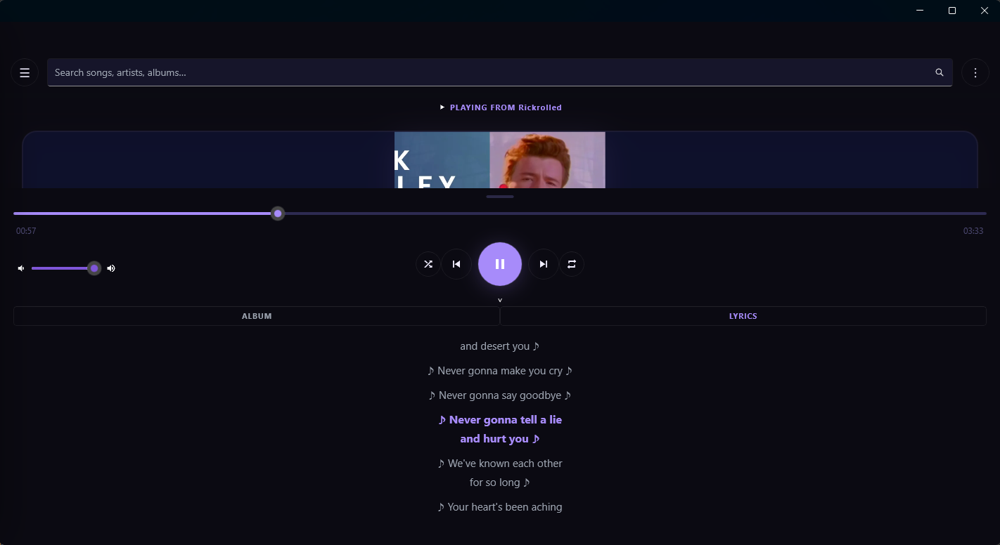
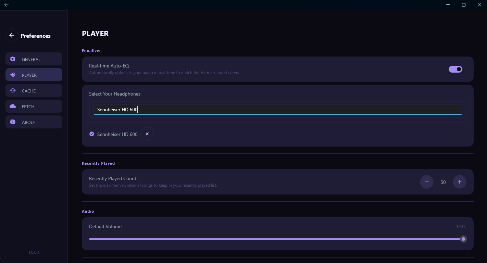

# MauiMixTube 🎵

A modern, cross-platform music player built with .NET MAUI, designed to solve the fundamental limitation of YouTube Music Web — shuffle only queues 50 songs regardless of playlist size.

Planned support for macOS and Android, but currently Windows-only.


### UI Preview

| Main | Lyrics | Settings |
| :---: | :---: | :---: |
|  |  |  |
|  |  |  |

---

## Features

### Playback
- **Unlimited shuffle** — the entire playlist, not just 50 songs
- **Hybrid playlists** — mix YouTube and Bilibili content in a single queue
- **Repeat modes** — Play Once / Repeat All / Repeat One
- **Seek support** with precise timestamp scrubbing
- **Hardware media key support** — keyboard media keys, Bluetooth headset controls, Windows taskbar media controls (SMTC)

### Audio Quality
- **Loudness normalization** — EBU R128 / YouTube target (-14 LUFS) via ffmpeg `loudnorm`
- **Auto EQ** — Harman Target curve with device-specific presets from [AutoEq](https://github.com/jaakkopasanen/AutoEq) database (7700+ devices)
- **Biquad filter implementation** — zero-allocation DSP processing with `Span<T>` and `ArrayPool`

### Library Management
- **Playlist import / export** — JSON format with smart merge (duplicate detection via record value equality)
- **Liked Songs** — system playlist, always available
- **Recently Played** — configurable history limit (default 50)

### Performance
- **PCM → Opus cache** — ~91% storage reduction (45MB → ~4MB per track), transparent seek support
- **Metadata cache** — instant track info on repeated playback
- **Chunked audio streaming** — `ArrayPool`-backed buffer with ordered async delivery
- **Fuzzy search** — hybrid Levenshtein + prefix scoring with zero-allocation `stackalloc` / `ArrayPool`
- **Prefetch** — background metadata loading with configurable concurrency

### UI / UX
- **Now Playing** — album art, title, artist, progress bar, volume
- **Album Panel** — paginated track listing with infinite scroll, current track highlight
- **Lyrics Panel** — synced lyrics with YouTube-style scroll behavior (follows current line, doesn't interrupt manual scroll)
- **Sidebar** — playlist library with fuzzy search
- **Settings** — theme, language, audio quality, UA customization, cache management, EQ device selection
- **Light / Dark theme** — dynamic, follows OS preference
- **i18n** — JSON-based localization with hot-reload, extensible language pack support

---

## Architecture

```
┌─────────────────────────────────────────┐
│                  UI Layer                │
│  MainPage · SettingsPage · LoadingPage  │
│  MainViewModel · SettingsViewModel      │
└────────────────┬────────────────────────┘
                 │
┌────────────────▼────────────────────────┐
│              Manager Layer               │
│  PlaylistManager · FetchManager         │
│  CacheManager · PlaylistRepository      │
│  SettingsManager · CookieService        │
│  MediaControlsService (SMTC)            │
└────────────────┬────────────────────────┘
                 │
┌────────────────▼────────────────────────┐
│               Audio Layer                │
│  AudioPipeline · ChunkedAudioStream     │
│  PcmPlayer (OpenAL) · AutoEqProcessor   │
│  BiquadFilter · FfmpegArgsPresets       │
└────────────────┬────────────────────────┘
                 │
┌────────────────▼────────────────────────┐
│             Fetch Services               │
│  YoutubeFetchService (YoutubeExplode    │
│    + yt-dlp fallback)                   │
│  BilibiliFetchService (yt-dlp           │
│    + legacy crawler fallback)           │
└─────────────────────────────────────────┘
```

### Key Design Decisions

- **`FetchService` is abstract** — new platforms inherit and register via DI, zero modification to existing code
- **`WebTag` is a strongly-typed string** — with source generator (`[WebTagProvider]`) for enum-like syntax (`WebTag.YouTube`)
- **Cache is two-layer** — metadata (JSON, instant) + PCM (Opus, persistent across sessions)
- **`ChunkedAudioStream`** — producer/consumer with `ArrayPool<byte>` chunks, supports seek without ffmpeg restart (via local cache)
- **EQ is post-decode** — applied on PCM buffer in `PcmPlayer`, no ffmpeg restart needed for real-time changes

---

## Requirements

- .NET 10 SDK
- Windows 10 1809+ (for OpenAL and SMTC support)
- [yt-dlp](https://github.com/yt-dlp/yt-dlp) — auto-downloaded on first launch
- [ffmpeg](https://ffmpeg.org) — bundled in `Resources/Raw/`

---

## Getting Started

```bash
git clone https://github.com/aqua0801/MauiMixTube.git
cd MauiMixTube
dotnet build MauiMixTube/MauiMixTube.csproj -f net10.0-windows10.0.19041.0
```

On first launch, yt-dlp will be downloaded automatically to `AppData/.../bin/`.

---

## Adding a New Platform (e.g. SoundCloud)

1. Create `SoundCloudFetchService : FetchService` in `/Managers/Fetch/Services/`
2. Add `[WebTagProvider]` class with `WebTag.SoundCloud`
3. Register in `MauiProgram.cs`:
```csharp
builder.Services.AddSingleton<FetchService, SoundCloudFetchService>();
```

That's it. No other files need modification.

---

## Localization

Language packs are JSON files in `AppData/.../Languages/`:

```json
{
  "Player_Play": "Play",
  "Player_Pause": "Pause",
  "Sidebar_Library": "Library"
}
```

Drop a new `.json` file into the `Languages/` folder and it appears in Settings automatically. Hot-reload supported — changes apply without restarting.

---

## AutoEQ Setup

1. Clone [AutoEq](https://github.com/jaakkopasanen/AutoEq)
2. Run the bundled Python script to generate `autoeq_database.json`
3. Place in `Resources/Raw/`

The database (~7.6MB) contains parametric EQ presets for 7700+ headphones and speakers.

---

## Dependencies

| Package | Purpose |
|---------|---------|
| CommunityToolkit.Maui | UI controls, FilePicker, FileSaver |
| CommunityToolkit.Mvvm | MVVM, ObservableObject, RelayCommand |
| YoutubeExplode | YouTube metadata, stream URLs, captions |
| YoutubeDLSharp | yt-dlp wrapper, Bilibili support |
| OpenTK | OpenAL bindings for PCM playback |

---

## Known Limitations

- **Windows only** currently for full feature support (OpenAL, SMTC, ffmpeg Process API)
- **YouTube Premium** content (256kbps AAC) requires manual cookie import — WebView login flow is a planned but unimplemented feature
- **iOS/Android** SMTC equivalent (MediaSession / MPNowPlayingInfoCenter) not yet implemented

---

## Background

Started as a Discord music bot that supported YouTube + Bilibili hybrid playlists. The local player grew from wanting the same experience without the 50-song shuffle limit. The crawler that powers Bilibili support predates yt-dlp support for Bilibili — it's kept as a fallback because it exists and it works.

---

## License

MIT

This is just a small project built with love and caffeine. 
You can use it, tweak it, or share it and it is provided 'as-is' without any warranties. 
If you find it useful, feel free to give it a ⭐️ on GitHub!

Check LICENSE.txt for more details.